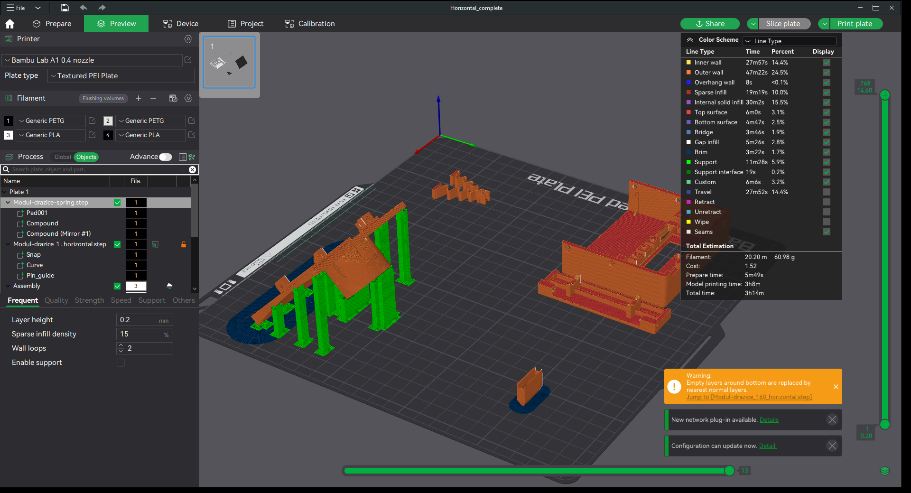
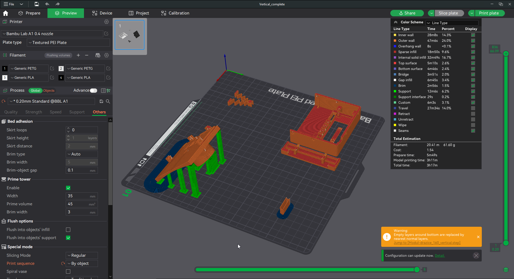
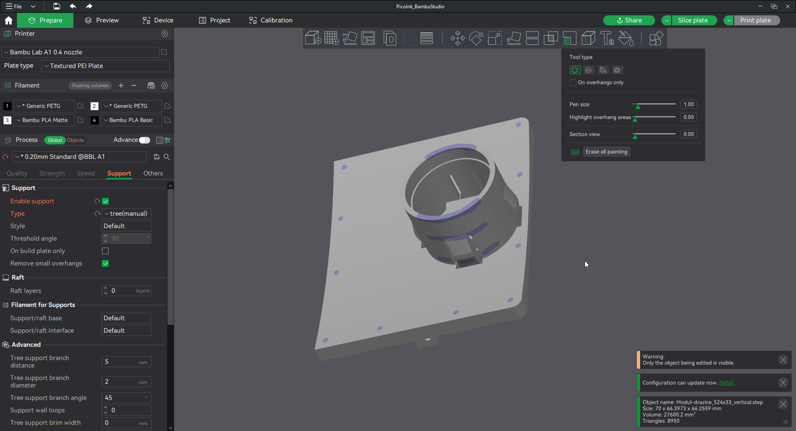
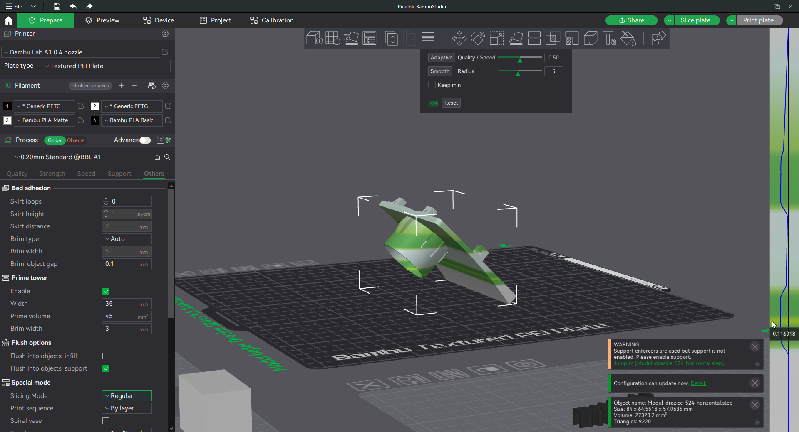

Model byl vytvořen ve FreeCADu, veškeré soubory jsou ve složce "FCStd model".\
Předpřipravené tiskové soubory 3mf byly vytvořeny v Bambu Studiu.
Modely byly v úspěšně tisknuty na tiskárně Bambulab A1.

* Základní část zařízení obsahuje:
  * **main_body** - PLA filament, udává barvu zařízení, základní profil
  * **battery_cover** - PLA filament, doporučena stejná barva jako main_body, základní profil
  * **display_holder** - PLA filament, na barvě nezáleží, základní profil
  * **light_guide** - PETG transparentní, nutný brim

* Modul pro měření teploty Bojleru Dražice
    * **spring** - PETG, na barvě nezáleží, základní profil, doporučen 3D Lack
    * **modul** - PETG, barva zadní části zařízení
      * nutný brim
      * tisknout diagonálně
      * manuální supporty podle obrázku
      * variabilní výška vrstvy podle obrázku (0.2 --> 0.12)
      * teplota trysky 260°C

