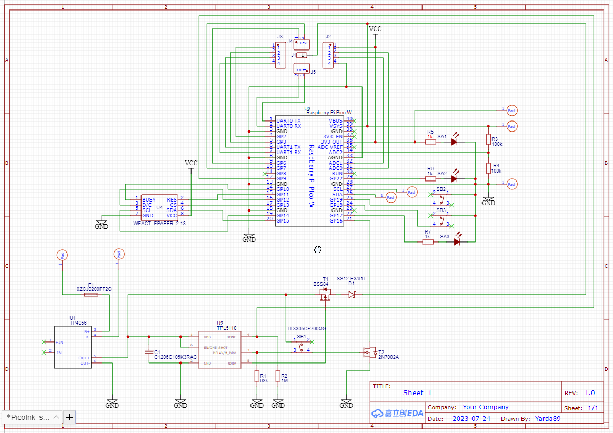
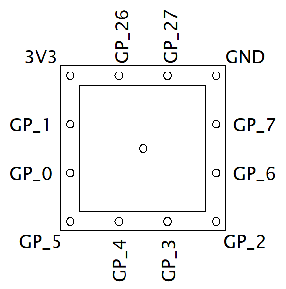
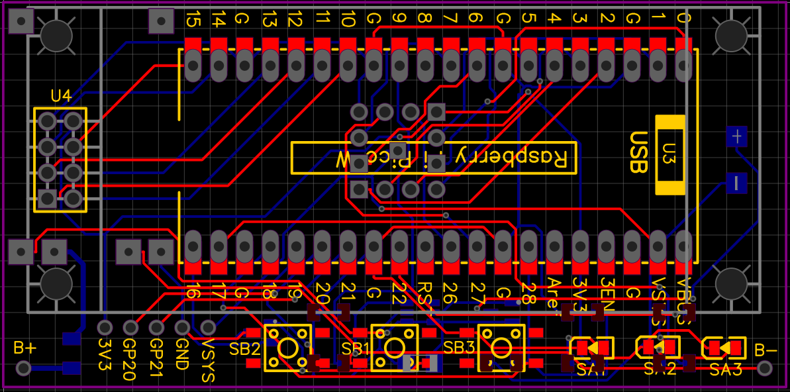

### Výroba elektro: 
1. Objednávka součástek podle [partlistu](./Partlist.md).
2. Soubor **Gerber_PCB_PicoInk.zip** obsahuje výrobní data - zaslat soubor výrobci.
3. Osazení PCB podle schématu. 
[Video osazovnání](https://www.youtube.com/watch?v=MjlOoAGtTvY&list=PL2hwsy43ra5UZU4RDyN6xl_J_FKD02n1o) |
[Komentované video](https://www.youtube.com/watch?v=83LGPPGywaA)

### Editace projektu:
1. Registrace na [EasyEDA](https://easyeda.com).
2. V EasyEDA Std designeru vytvořit nový projekt.
3. File --> File Source --> vložit obsah souboru **SCH_PicoInk.json**
4. Design --> Convert Schematic to PCB --> Save
5. File --> File Source --> vložit obsah souboru **PCB_PicoInk.json**

### Schéma:

### Konektor:

### PCB:
