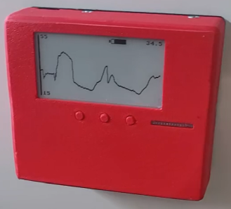

# PicoInk 

PicoInk byl vyvinutý za účelem měření fyzikálních veličin v místech, kde není třeba měřit velice často, ale postačuje jedno měření za 15 minut. Například: teplota, výška hladiny, koncentrace CO2, vlhkost půdy, vlhkost vzduchu, a podobně. Z této podstaty byl v návrhu kladen důraz na dlouhou výdrž baterie. 
Oproti podobným zařízením, které využívají deep-sleep režim mikrokontroléru, se zde o periodické měření stará externí časovací obvod [TPL5110](https://www.ti.com/lit/ds/symlink/tpl5110.pdf), který má v odpočítávací fázi téměř neměřitelnou spotřebu (35nA). 
Dalším prvkem, který přispívá k dlouhé výdrži baterie je e-inkový displej, který ze své technické podstaty zobrazuje informace, přestože je baterie odpojena. Za normálních okolností musí displej po připojení k napájení projít tzv. full-refreshem. Full-refresh není příliš estetická záležitost a je také energeticky náročná. Tyto důvody vedly k vývoji knihovny obsluhující displej s možností částečného překreslení i bez full-refreshe.
Horizontální rozlišení použitelného e-ink displeje je 250 pixelů. Pokud využijeme displej k vykreslení průběhu naměřených hodnot, přičemž každá hodnota zabere jeden pixel, můžeme vykreslit historii v grafu v délce necelých tří dnů, konkrétně 62,5 hodin.\
**To z něj v dělá jedinečný bateriový teploměr schopen nepřetržitého zobrazení historie hodnot v grafu.**
Jelikož je mozkem celého zařízení mikrokontrolér Raspberry Pi Pico W, dostupná je konektivita ve formě Bluetooth Low Energy a 2.4GHz WiFi. 
Pro zasílání naměřených hodnot přes Bluetooth byl zvolen otevřený protokol BTHome, ve formě pasivních advertisement zpráv. Důvodem je skvělá kompatibilita a super-rychlá integrace v Home Assistant.
V případě využití WiFi byl zvolen protokol MQTT, který lze rovněž vcelku jednoduše zaintegrovat do Home Assistant systému.\
**Výdrž baterie Liitokala 3500mAh s použitím teplotního a vlhkostního snímače SHT41 s vypnutým vyhříváním a připojení k WiFi s kvalitním signálem byla naměřena na 6 měsíců, cca 10000 měření.**
Baterií je myšlen akumulátor typu 18650, který je možno dobít přes USB-C konektor.
Pro rychlou výměnu lze baterii vyjmout a nahradit baterií čerstvě nabitou.

PicoInk je fyzicky složen ze dvou částí:
* Hlavní část obsahující elektroniku, baterii, displej a desku spojů.
* Modul, který je odnímatelný. Podle jeho typu zařízení plní svůj účel - zde je umístěn snímač.

Spojení mezi těmito částmi zajišťuje konektor, přes který lze modul napájet. Buďto z 3.3V zdroje mikrokontroléru nebo přímo z baterie. 
Dále obsahuje piny, jenž lze použít pro analogové měření nebo sběrnice UART, SPI, I2C, OneWire (viz.doc).
PicoInk je možné po úpravě software využívat i bez modulu. Například pro zobrazování online dat.

**V současné době jsou plně vyvinuty dva moduly - snímač teploty pro horizontální a vertikální bojler.**\
Avšak PicoInk byl otestován a má softwarovou přípravu na: 
* Snímač CO2 SCD41. Výdrž baterie klesla na jeden měsíc (s WiFi).
* Analogový snímač pro kapacitní měření vlhkosti půdy. Vlhkost klesá velmi pomalu, graf je krátký.
* Teplotní a vlhkostní snímač DHT22, měření snímače trvá různou dobu, někdy i velmi dlouho.
* Teplotní a vlhkostní snímač SHT41, vše OK.
* Teplotní snímač Dallas DS18B20, nutné použít originál, jinak vše OK.

**Známé bugy:**\
~~* Při delším vyjmutí baterie dojde k vybití vnitřního kondenzátoru. \
Při opětovném vložení nabitého článku dochází k proudové mikrošpičce. \
Z toho důvodu dojde k deaktivaci výstupu ochranného obvodu. \
Baterii je tedy nutno znovu vytáhnout a vložit. Ve zkratce - **baterii je někdy třeba vložit na dvakrát.**~~\
(Vyřešeno změnou hodnoty kondenzátoru C1 z 1uF na 100nF)

**TODO list:**
- [x] Moduly pro různé bojlery
- [x] Návod k použití pro normální lidi (pdf)
- [x] Tiskové instrukce (README.md ve složce 3D)
- [x] Instrukce ke stavbě zařízení (pdf)
- [x] Instrukce k výměně baterie a montáži/demontáži modulu (pdf)
- [x] Instrukce k naprogramování kontroléru (README.md ve složce Code)
- [x] Instrukce k výrobě PCB (README.md ve složce Electric)

[Zde](https://www.facebook.com/profile.php?id=61566121148711) mě můžete přímo kontaktovat.
